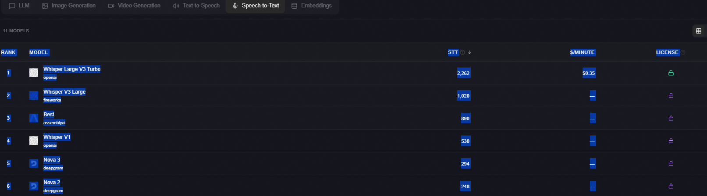

数据来源：https://llm-stats.com/

Rank	Model	Code Arena	Chat Arena	GPQA	SWE-bench	Context	Input $/M	Output $/M	License
1
Anthropic
Claude Opus 4.6
Anthropic
1,998	1,491	91.3%	80.8%	1.0M	$5.00	$25.00	
Proprietary
2
Google
Gemini 3.1 Pro
Google
1,941	1,222	94.3%	80.6%	1.0M	$2.50	$15.00	
Proprietary
3
OpenAI
GPT-5.4
OpenAI
1,638	1,146	92.8%	—	1.0M	$2.50	$15.00	
Proprietary
4
Anthropic
Claude Opus 4.5
Anthropic
1,590	1,345	87.0%	80.9%	200K	$5.00	$25.00	
Proprietary
5
Zhipu AI
GLM-5
Zhipu AI
1,588	1,158	—	77.8%	200K	$1.00	$3.20	
Open Source
6
Google
Gemini 3 Pro
Google
1,579	1,045	91.9%	76.2%	—	—	—	
Proprietary
7
Google
Gemini 3 Flash
Google
1,579	1,172	90.4%	78.0%	1.0M	$0.50	$3.00	
Proprietary
8
OpenAI
GPT-5.2
OpenAI
1,500	1,180	92.4%	80.0%	400K	$1.75	$14.00	
Proprietary
9
Moonshot AI
Kimi K2.5
Moonshot AI
1,468	1,003	87.6%	76.8%	262K	$0.60	$2.50	
Open Source
10
Anthropic
Claude Sonnet 4.6
Anthropic
1,365	941	89.9%	79.6%	200K	$3.00	$15.00	
Proprietary
11
OpenAI
GPT-5 High
OpenAI
1,301	1,037	87.3%	—	400K	$1.25	$10.00	
Proprietary
12
OpenAI
GPT-5.1
OpenAI
1,234	1,018	88.1%	76.3%	400K	$1.25	$10.00	
Proprietary
13
Zhipu AI
GLM-5.1
NEW
Zhipu AI
1,234	-179	86.2%	—	200K	$1.40	$4.40	
Open Source
14
Alibaba Cloud / Qwen Team
Qwen3.5-397B-A17B
Alibaba Cloud / Qwen Team
1,212	1,067	88.4%	76.4%	262K	$0.60	$3.60	
Open Source
15
OpenAI
GPT-5.2 Codex
OpenAI
1,149	812	—	—	400K	$1.75	$14.00	
Proprietary
16
Google
Gemini 3.1 Flash-Lite
Google
1,146	328	86.9%	—	1.0M	$0.25	$1.50	
Proprietary
17
Zhipu AI
GLM-4.6
Zhipu AI
1,139	1,079	81.0%	68.0%	131K	$0.55	$2.19	
Open Source
18
OpenAI
GPT-5.1 High
OpenAI
1,137	1,132	88.1%	—	400K	$1.25	$10.00	
Proprietary
19
OpenAI
GPT-5.3 Codex
OpenAI
1,105	945	—	—	400K	$1.75	$14.00	
Proprietary
20
OpenAI
GPT-5.4 mini
OpenAI
1,100	821	88.0%	—	400K	$0.75	$4.50	
