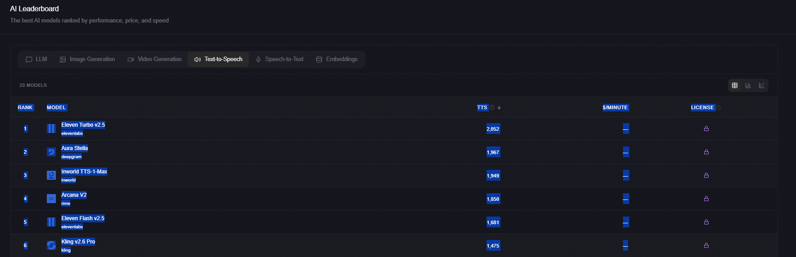

数据来源：https://llm-stats.com/

Rank	Model	STT	$/Minute	License
1
openai
Whisper Large V3 Turbo
openai
2,262	$0.35	
Open Source
2
fireworks
Whisper V3 Large
fireworks
1,020	—	
Proprietary
3
assemblyai
Best
assemblyai
890	—	
Proprietary
4
openai
Whisper V1
openai
538	—	
Proprietary
5
deepgram
Nova 3
deepgram
294	—	
Proprietary
6
deepgram
Nova 2
deepgram
-248	—	
Proprietary
7
anthropic
Claude Sonnet 4.5
anthropic
-424	$3.00	
Proprietary
8
mistral
Voxtral Mini
mistral
-517	—	
Open Source
9
deepgram
Nova 2 Medical
deepgram
-797	—	
Proprietary
10
assemblyai
Nano
assemblyai
-913	—	
Proprietary
11
fireworks
Whisper V3 Turbo
fireworks
-1,389	—	
