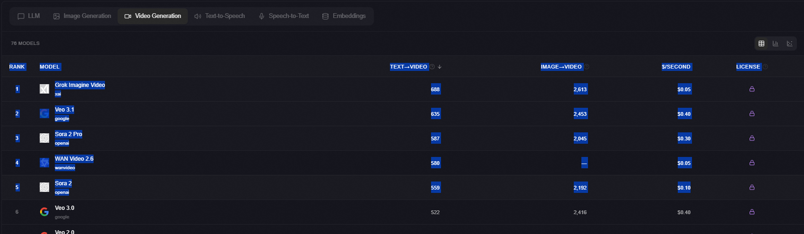

数据来源：https://llm-stats.com/

Rank	Model	TTS	$/Minute	License
1
elevenlabs
Eleven Turbo v2.5
elevenlabs
2,052	—	
Proprietary
2
deepgram
Aura Stella
deepgram
1,967	—	
Proprietary
3
inworld
Inworld TTS-1-Max
inworld
1,949	—	
Proprietary
4
rime
Arcana V2
rime
1,850	—	
Proprietary
5
elevenlabs
Eleven Flash v2.5
elevenlabs
1,681	—	
Proprietary
6
kling
Kling v2.6 Pro
kling
1,475	—	
Proprietary
7
deepgram
Aura Luna
deepgram
1,468	—	
Proprietary
8
cartesia
Sonic Multilingual
cartesia
1,449	—	
Proprietary
9
cartesia
Sonic 3
cartesia
1,448	—	
Proprietary
10
bytedance
Seedance 1.5 Pro
bytedance
1,435	—	
Proprietary
11
minimax
Speech 2.5 HD Preview
minimax
1,420	—	
Proprietary
12
deepgram
Aura Asteria
deepgram
1,395	—	
Proprietary
13
playai
PlayAI Dialog v1.0
playai
1,378	—	
Proprietary
14
inworld
Inworld TTS-1
inworld
1,376	—	
Proprietary
15
elevenlabs
Multilingual V2
elevenlabs
1,267	—	
Proprietary
16
minimax
Speech 02 HD
minimax
1,263	—	
Proprietary
17
cartesia
Sonic English
cartesia
1,232	—	
Proprietary
18
elevenlabs
Eleven v3
elevenlabs
1,224	—	
Proprietary
19
openai
TTS-1 HD
openai
1,173	—	
Proprietary
20
openai
TTS-1
openai
1,169	—	
