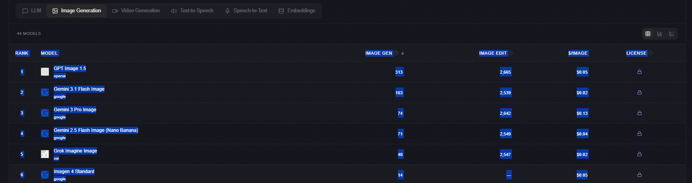

数据来源：https://llm-stats.com/

Rank	Model	Image Gen	Image Edit	$/Image	License
1
openai
GPT Image 1.5
openai
313	2,665	$0.05	
Proprietary
2
google
Gemini 3.1 Flash Image
google
163	2,539	$0.02	
Proprietary
3
google
Gemini 3 Pro Image
google
74	2,642	$0.13	
Proprietary
4
google
Gemini 2.5 Flash Image (Nano Banana)
google
71	2,549	$0.04	
Proprietary
5
xai
Grok Imagine Image
xai
40	2,547	$0.02	
Proprietary
6
google
Imagen 4 Standard
google
14	—	$0.05	
Proprietary
7
bytedance
Seedream 4.5
bytedance
-15	2,516	$0.04	
Proprietary
8
black-forest-labs
Flux 2 Max
black-forest-labs
-36	2,395	$0.06	
Proprietary
9
black-forest-labs
Flux 2 Pro
black-forest-labs
-57	2,344	$0.02	
Proprietary
10
black-forest-labs
Flux 2 Flex
black-forest-labs
-58	2,218	$0.06	
Proprietary
11
google
Imagen 4 Ultra
google
-65	—	$0.10	
Proprietary
12
qwen
Qwen Image 2.0
qwen
-106	—	$0.03	
Proprietary
13
openai
GPT Image 1 Mini
openai
-125	2,004	$0.01	
Proprietary
14
openai
GPT Image 1
openai
-146	2,066	$0.04	
Proprietary
15
xai
Grok Imagine Image Pro
xai
-152	—	$0.07	
Proprietary
16
reve-ai
Reve
reve-ai
-214	2,460	$0.18	
Proprietary
17
bytedance
Seedream 4
bytedance
-221	2,396	$0.03	
Proprietary
18
black-forest-labs
Flux Kontext Max
black-forest-labs
-223	2,173	$0.08	
Proprietary
19
black-forest-labs
Flux 1.1 Pro Ultra
black-forest-labs
-238	1,644	$0.06	
Proprietary
20
bytedance
Seedream 3
bytedance
-264	—	$0.03	
