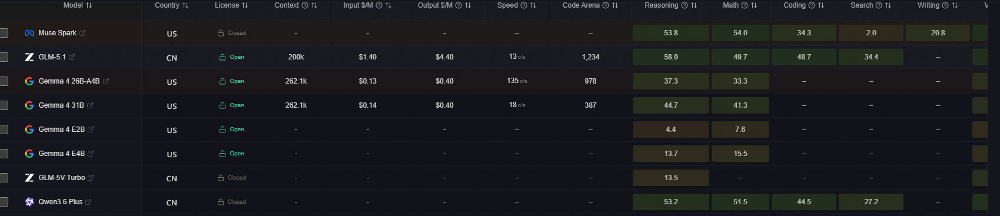
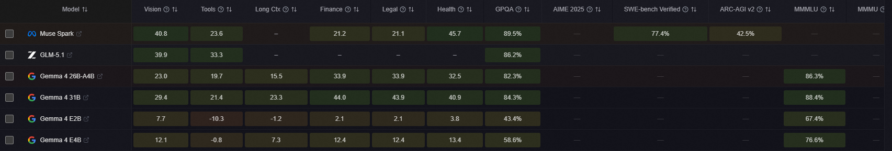
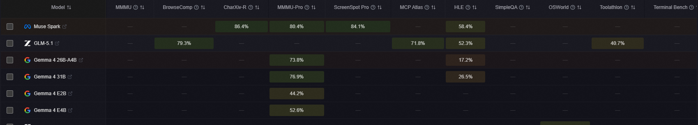
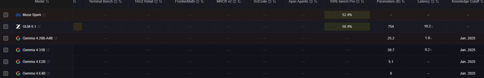
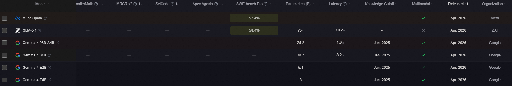

数据来源：https://llm-stats.com/leaderboards/llm-leaderboard

Model

Country

License

Context

Input $/M

Output $/M

Speed

Code Arena

Reasoning

Math

Coding

Search

Writing

Vision

Tools

Long Ctx

Finance

Legal

Health

GPQA

AIME 2025

SWE-bench Verified

ARC-AGI v2

MMMLU

MMMU

BrowseComp

CharXiv-R

MMMU-Pro

ScreenSpot Pro

MCP Atlas

HLE

SimpleQA

OSWorld

Toolathlon

Terminal Bench

TAU2 Retail

FrontierMath

MRCR v2

SciCode

Apex Agents

SWE-bench Pro

Parameters (B)

Latency

Knowledge Cutoff

Multimodal

Released

Organization

Meta logo
Muse Spark
🇺🇸
Closed
-	-	-	–	–	
53.8
54.0
34.3
2.0
20.8
40.8
23.6
–	
21.2
21.1
45.7
89.5%
—	
77.4%
42.5%
—	—	—	
86.4%
80.4%
84.1%
—	
58.4%
—	—	—	—	—	—	—	—	—	
52.4%
-	–	-	
Apr. 2026	
Meta

Zhipu AI logo
GLM-5.1
🇨🇳
Open
200k	$1.40	$4.40	13c/s	1,234	
58.0
49.7
48.7
34.4
–	
39.9
33.3
–	–	–	–	
86.2%
—	—	—	—	—	
79.3%
—	—	—	
71.8%
52.3%
—	—	
40.7%
—	—	—	—	—	—	
58.4%
754	10.2s	-	
Apr. 2026	
ZAI

Google logo
Gemma 4 26B-A4B
🇺🇸
Open
262.1k	$0.13	$0.40	135c/s	978	
37.3
33.3
–	–	–	
23.0
19.7
15.5
33.9
33.9
32.5
82.3%
—	—	—	
86.3%
—	—	—	
73.8%
—	—	
17.2%
—	—	—	—	—	—	—	—	—	—	25.2	1.9s	Jan. 2025	
Apr. 2026	
Google

Google logo
Gemma 4 31B
🇺🇸
Open
262.1k	$0.14	$0.40	18c/s	387	
44.7
41.3
–	–	–	
29.4
21.4
23.3
44.0
43.9
40.9
84.3%
—	—	—	
88.4%
—	—	—	
76.9%
—	—	
26.5%
—	—	—	—	—	—	—	—	—	—	30.7	8.2s	Jan. 2025	
Apr. 2026	
Google

Google logo
Gemma 4 E2B
🇺🇸
Open
-	-	-	–	–	
4.4
7.6
–	–	–	
7.7
-10.3
-1.2
2.1
2.1
3.8
43.4%
—	—	—	
67.4%
—	—	—	
44.2%
—	—	—	—	—	—	—	—	—	—	—	—	—	5.1	–	Jan. 2025	
Apr. 2026	
Google

Google logo
Gemma 4 E4B
🇺🇸
Open
-	-	-	–	–	
13.7
15.5
–	–	–	
12.1
-0.8
7.3
12.4
12.4
13.4
58.6%
—	—	—	
76.6%
—	—	—	
52.6%
—	—	—	—	—	—	—	—	—	—	—	—	—	8	–	Jan. 2025	
Apr. 2026	
Google

Zhipu AI logo
GLM-5V-Turbo
🇨🇳
Closed
-	-	-	–	–	
13.5
–	–	–	–	
29.3
–	–	–	–	–	—	—	—	—	—	—	—	—	—	—	—	—	—	
62.3%
—	—	—	—	—	—	—	—	-	–	-	
Apr. 2026	
ZAI

Alibaba Cloud / Qwen Team logo
Qwen3.6 Plus
🇨🇳
Closed
-	-	-	–	–	
53.2
51.5
44.5
27.2
–	
37.0
32.3
37.0
56.8
56.9
54.0
90.4%
—	
78.8%
—	
89.5%
86.0%
—	
81.5%
78.8%
68.2%
74.1%
28.8%
—	—	
39.8%
—	—	—	—	—	—	
56.6%
-	–	-	
Mar. 2026	
Qwen

Xiaomi logo
MiMo-V2-Omni
🇨🇳
Closed
262k	$0.40	$2.00	–	226	
47.1
–	
30.1
–	–	–	–	–	
11.9
11.9
–	—	—	
74.8%
—	—	—	—	—	—	—	—	—	—	—	—	—	—	—	—	—	—	—	-	–	-	
Mar. 2026	
Xiaomi

Xiaomi logo
MiMo-V2-Pro
🇨🇳
Closed
1M	$1.00	$3.00	–	30	
52.4
–	
36.3
29.4
29.2
–	
27.4
–	
17.1
17.1
–	—	—	
78.0%
—	—	—	—	—	—	—	—	—	—	—	—	—	—	—	—	—	—	—	1000	–	-	
Mar. 2026	
Xiaomi

MiniMax logo
MiniMax M2.7
🇨🇳
Open
204.8k	$0.30	$1.20	43c/s	1,008	
53.0
–	
40.0
–	–	–	
26.3
–	
-5.8
-5.8
–	—	—	—	—	—	—	—	—	—	—	—	—	—	—	
46.3%
—	—	—	—	—	—	
56.2%
-	1.9s	-	
Mar. 2026	
MiniMax

OpenAI logo
GPT-5.4 mini
🇺🇸
Closed
400k	$0.75	$4.50	100c/s	1,100	
47.6
37.2
36.7
–	
22.7
31.1
27.0
23.4
–	–	
27.7
88.0%
—	—	—	—	—	—	—	
76.6%
—	
57.7%
28.2%
—	—	
42.9%
—	—	—	
33.6%
—	—	
54.4%
-	942ms	Aug. 2025	
Mar. 2026	
OpenAI

OpenAI logo
GPT-5.4 nano
🇺🇸
Closed
400k	$0.20	$1.25	386c/s	741	
41.8
34.0
25.9
–	
21.4
23.6
17.7
23.2
–	–	
33.9
82.8%
—	—	—	—	—	—	—	
66.1%
—	
56.1%
24.3%
—	—	
35.5%
—	—	—	
33.1%
—	—	
52.4%
-	729ms	Aug. 2025	
Mar. 2026	
OpenAI

Mistral AI logo
Mistral Small 4
🇫🇷
Open
256k	$0.15	$0.60	–	-376	
25.3
25.3
16.9
–	–	
13.7
–	
40.0
22.8
22.7
22.4
71.2%
83.8%
—	—	—	—	—	—	
60.0%
—	—	—	—	—	—	—	—	—	—	—	—	—	119	–	-	
Mar. 2026	
Mistral

NVIDIA logo
Nemotron 3 Super (120B A12B)
🇺🇸
Open
262.1k	$0.10	$0.50	321c/s	-95	
31.6
39.0
18.6
1.2
13.8
21.1
6.4
19.3
37.1
37.2
36.9
82.7%
90.2%
53.7%
—	—	—	
31.3%
—	—	—	—	
22.8%
—	—	—	
25.8%
—	—	—	
42.0%
—	—	120	2.0s	Jun. 2025	
Mar. 2026	
Nvidia

xAI logo
Grok-4.20 Beta Non-Reasoning
🇺🇸
Closed
2M	$2.00	$6.00	25c/s	1,006	–	–	–	–	–	–	–	
14.8
–	–	–	—	—	—	—	—	—	—	—	—	—	—	—	—	—	—	—	—	—	—	—	—	—	-	366ms	-	
Mar. 2026	
xAI

xAI logo
Grok-4.20 Beta Reasoning
🇺🇸
Closed
2M	$2.00	$6.00	83c/s	475	–	–	–	–	–	–	–	
30.0
–	–	–	—	—	—	—	—	—	—	—	—	—	—	—	—	—	—	—	—	—	—	—	—	—	-	4.5s	-	
Mar. 2026	
xAI

xAI logo
Grok-4.20 Multi-Agent Beta
🇺🇸
Closed
2M	$2.00	$6.00	–	643	–	–	–	–	–	–	–	–	–	–	–	—	—	—	—	—	—	—	—	—	—	—	—	—	—	—	—	—	—	—	—	—	—	-	–	-	
Mar. 2026	
xAI

Sarvam AI logo
Sarvam-105B
🇮🇳
Open
-	-	-	–	–	
34.1
36.6
5.0
10.7
–	
8.0
–	–	
36.4
36.4
35.7
78.7%
96.7%
45.0%
—	—	—	
49.5%
—	—	—	—	
11.2%
—	—	—	—	—	—	—	—	—	—	105	–	-	
Mar. 2026	
Sarvam AI

Sarvam AI logo
Sarvam-30B
🇮🇳
Open
-	-	-	–	–	
25.1
29.4
12.8
3.2
–	–	–	–	
22.9
22.9
22.5
66.5%
96.7%
34.0%
—	—	—	
35.5%
—	—	—	—	—	—	—	—	—	—	—	—	—	—	—	30	–	-	
Mar. 2026	
Sarvam AI

OpenAI logo
GPT-5.4
🇺🇸
Closed
1M	$2.50	$15.00	32c/s	1,638	
58.3
46.3
46.0
36.0
35.3
39.6
37.1
28.4
3.7
–	
30.6
92.8%
—	—	
73.3%
—	—	
82.7%
—	
81.2%
—	
67.2%
39.8%
—	—	
54.6%
—	—	
47.6%
—	—	—	
57.7%
-	2.5s	-	
Mar. 2026	
OpenAI

OpenAI logo
GPT-5.3 Chat
🇺🇸
Closed
128k	$1.75	$14.00	–	338	–	–	–	–	–	–	–	–	–	–	
28.1
—	—	—	—	—	—	—	—	—	—	—	—	—	—	—	—	—	—	—	—	—	—	-	–	Aug. 2025	
Mar. 2026	
OpenAI

Google logo
Gemini 3.1 Flash-Lite
🇺🇸
Closed
1M	$0.25	$1.50	271c/s	1,146	
41.5
33.1
–	–	–	
27.3
–	
27.5
–	–	
36.4
86.9%
—	—	—	
88.9%
—	—	
73.2%
76.8%
—	—	
16.0%
43.3%
—	—	—	—	—	
60.1%
—	—	—	-	2.6s	Jan. 2025	
Mar. 2026	
Google

Alibaba Cloud / Qwen Team logo
Qwen3.5-0.8B
🇨🇳
Open
-	-	-	–	–	
-14.0
-7.7
–	–	
-12.6
-17.8
-20.2
-14.9
-6.7
-6.7
-7.0
11.9%
—	—	—	
44.3%
—	—	—	—	—	—	—	—	—	—	—	—	—	—	—	—	—	0.8	–	-	
Mar. 2026	
Qwen

Alibaba Cloud / Qwen Team logo
Qwen3.5-2B
🇨🇳
Open
-	-	-	–	–	
0.7
4.9
–	–	
-6.0
-3.7
-3.3
0.7
5.3
5.3
4.8
51.6%
—	—	—	
63.1%
—	—	—	—	—	—	—	—	—	—	—	—	—	—	—	—	—	2	–	-	
Mar. 2026	
Qwen

Alibaba Cloud / Qwen Team logo
Qwen3.5-4B
🇨🇳
Open
-	-	-	–	–	
23.6
24.3
–	–	
12.7
15.6
9.7
12.2
24.5
24.5
24.1
76.2%
—	—	—	
76.1%
—	—	—	—	—	—	—	—	—	—	—	—	—	—	—	—	—	4	–	-	
Mar. 2026	
Qwen

Alibaba Cloud / Qwen Team logo
Qwen3.5-9B
🇨🇳
Open
-	-	-	–	–	
30.5
29.9
–	–	
16.4
21.1
10.4
22.5
31.9
32.0
31.6
81.7%
—	—	—	
81.2%
—	—	—	—	—	—	—	—	—	—	—	—	—	—	—	—	—	9	–	-	
Mar. 2026	
Qwen

Inception logo
Mercury 2
🇺🇸
Closed
128k	$0.25	$0.75	1,020c/s	166	
30.7
32.6
20.2
–	
7.5
–	
3.9
–	–	–	–	
74.0%
91.1%
—	—	—	—	—	—	—	—	—	—	—	—	—	—	—	—	—	
38.0%
—	—	-	1.3s	-	
Feb. 2026	
Inception

Alibaba Cloud / Qwen Team logo
Qwen3.5-122B-A10B
🇨🇳
Open
262.1k	$0.40	$3.20	–	859	
43.9
44.8
28.5
24.3
24.5
32.9
15.7
32.4
50.0
50.1
48.5
86.6%
—	
72.0%
—	
86.7%
83.9%
63.8%
77.2%
76.9%
70.4%
—	
47.5%
—	—	—	—	—	—	—	—	—	—	122	–	-	
Feb. 2026	
Qwen

Alibaba Cloud / Qwen Team logo
Qwen3.5-27B
🇨🇳
Open
262.1k	$0.30	$2.40	59c/s	482	
43.0
43.3
23.9
22.5
22.4
31.8
14.7
31.8
47.8
47.9
45.8
85.5%
—	
72.4%
—	
85.9%
82.3%
61.0%
79.5%
75.0%
70.3%
—	
48.5%
—	—	—	—	—	—	—	—	—	—	27	2.5s	-	
Feb. 2026	
Qwen